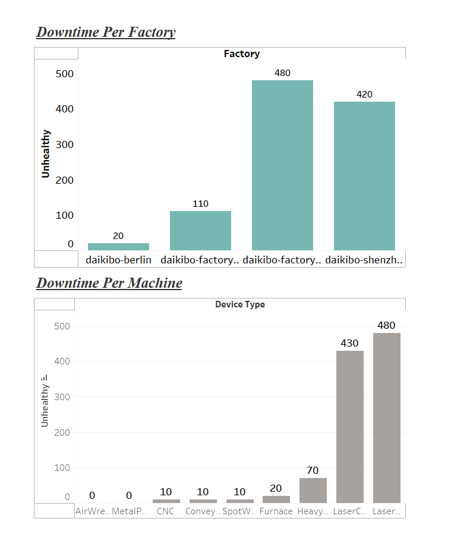

# Deloitte Australia Data Analytics Job Simulation (Forage) - May 2025

This repository contains materials and deliverables related to the **Deloitte Australia Data Analytics & Forensic Technology Job Simulation** completed on the [Forage](https://www.theforage.com) platform in May 2025.

## 📊 Project Overview

The job simulation provided hands-on experience with Deloitte’s approach to solving real-world business problems using data analytics and forensic technology.

## ✅ Key Tasks Completed

- **Data Dashboard Creation:**  
  Developed an interactive dashboard using **Tableau** to visualize trends and insights for a business case scenario.

- **Excel-Based Data Analysis:**  
  Used **Microsoft Excel** to classify raw data, perform data cleaning, and derive actionable business insights.

## 🖼️ Dashboard Preview

## 🛠 Tools & Technologies

- **Tableau**  
- **Microsoft Excel**  
- **Forage Virtual Experience Platform**

## 📁 Structure

